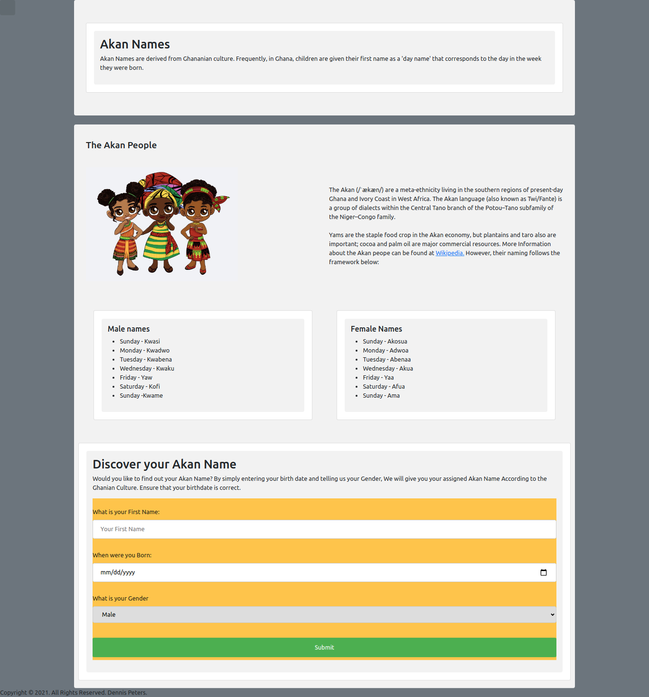

# DENNIS NJENGA SECOND IP SUBMISSION

### Project Name: AKAN NAMES

### Project Description
An individual project to display a web application that takes a user's birthday and calculates the day of the week they were born and then depending on their gender outputs their Akan Name.

### Setup Instructions
The operations of the project are fairly straighforward. 
The application makes use of bootstrap as well as a custom CSS file.
Google Chrome is highly recommend to run the program.

### BDD
Input includes a name, birthday date and gender. On submit backened code runs evaluations to validate the output

### Author: [DENNIS NJENGA](https://github.com/deepeters)
### Contact Infomation:
         Email: dennis@dennis.com
         Phone: +254712345678

### Technology Used
1. HTML
2. CSS
3. Javascript

### LICENSE: [MIT LICENSE](https://raw.githubusercontent.com/deepeters/second-ip/master/LICENSE)
